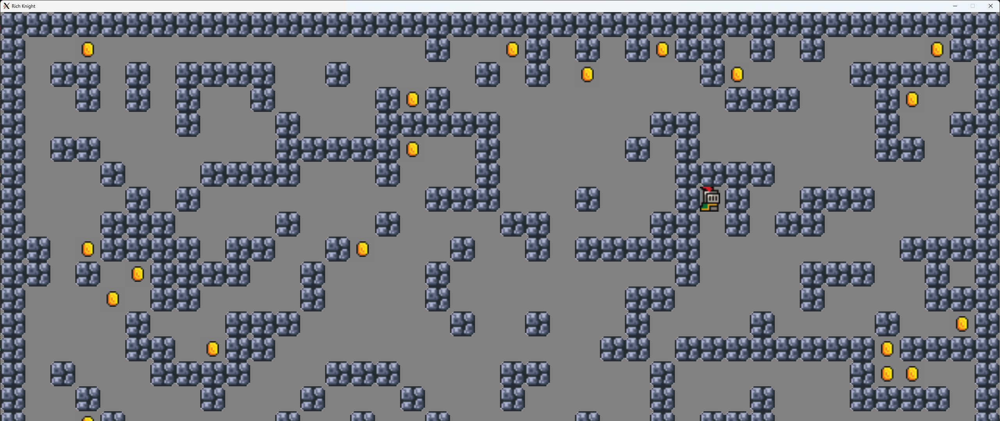
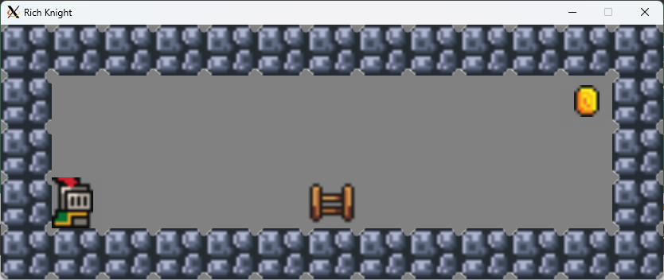
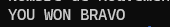
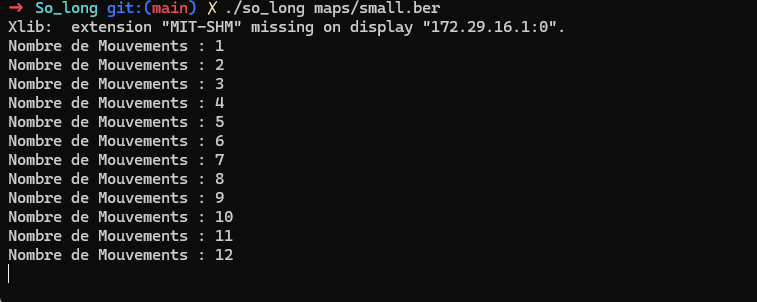

<h1 align="center">
 so_long
</h1>
<div align="center">
  
</div>

## Description

The `so_long` project is a small 2D game built using the **miniLibX** graphics library. <br>

The goal is to create a top-down game where the player must collect all the items (coins) on a map <br>
and then reach the exit, all while navigating around walls and keeping track of the total number of movements.
<br clear="both">

## Instructions
### Prerequistes
**For Linux and MacOS**
This project requires the GNU Compiler Collection, the GNU Make compiler, [MiniLibX](https://github.com/42Paris/minilibx-linux#readme) (already in main) and X11 Development Libraries and Headers (`sudo apt-get install libx11-dev`).

**For Windows**
This project uses the Linux version of MiniLibX and is intended to be compiled inside WSL (Windows Subsystem for Linux), not directly with a native Windows compiler.
To display the game window on Windows, we need to install an X server such as VcXsrv and launch it with XLaunch.

### Compilation
To compile the project, run:
```bash
make
```
### Usage
Run the program with a valid `.ber` map file as an argument:
```bash
./so_long maps/valid/small.ber
```
If the map is valid, a graphical window will open, and you can start playing!

<div align="center">
  
</div>

## Game Mechanics & Rules

- The player must collect all the Collectibles (`C`) on the map.
- Once all collectibles are gathered, the Exit (`E`) will open and the player can step on it to win.

<div align="center">
  
</div>

- The player cannot walk through Walls (`1`).
- Every step the player takes is counted and printed in the terminal.

<div align="center">
  
</div>

### Controls
(Arrows dont work on windows machines)
- `W` or `↑` (Up Arrow): Move Up
- `A` or `←` (Left Arrow): Move Left
- `S` or `↓` (Down Arrow): Move Down
- `D` or `→` (Right Arrow): Move Right
- `ESC` or `Q`: Close the window and quit the game cleanly.

## Map Configuration

Maps must be passed as .ber files and adhere to the following rules:

- Must be strictly rectangular.
- Must be completely closed/surrounded by walls (`1`).
- Must contain **exactly one** Player starting position (`P`).
- Must contain **exactly one** Exit (`E`).
- Must contain **at least one** Collectible (`C`).
- Allowed characters: `0`, `1`, `C`, `E`, `P`

Example of a valid map:
```Text
1111111111111
10010000000C1
1000011111001
1P0011E000001
1111111111111
```
## Technical Implementation

### Parsing & Validation Strategy
1. **File Reading**: Uses `get_next_line` to read the map line by line and store it into a 2D array.

2. **Format Checking**: Iterates through the 2D array to ensure the map is rectangular, properly walled off,  
and contains no invalid characters.

3. **Flood-Fill Algorithm (Pathfinding)**: Before the game launches, a **Depth-First Search (DFS) Flood-Fill**  
algorithm  is executed on a copy of the map. It starts from the player's position and spreads to verify that **every single collectible**  
and the **exit** are reachable without walking through walls.  
If any item is trapped, the game throws an error and refuses to launch.
